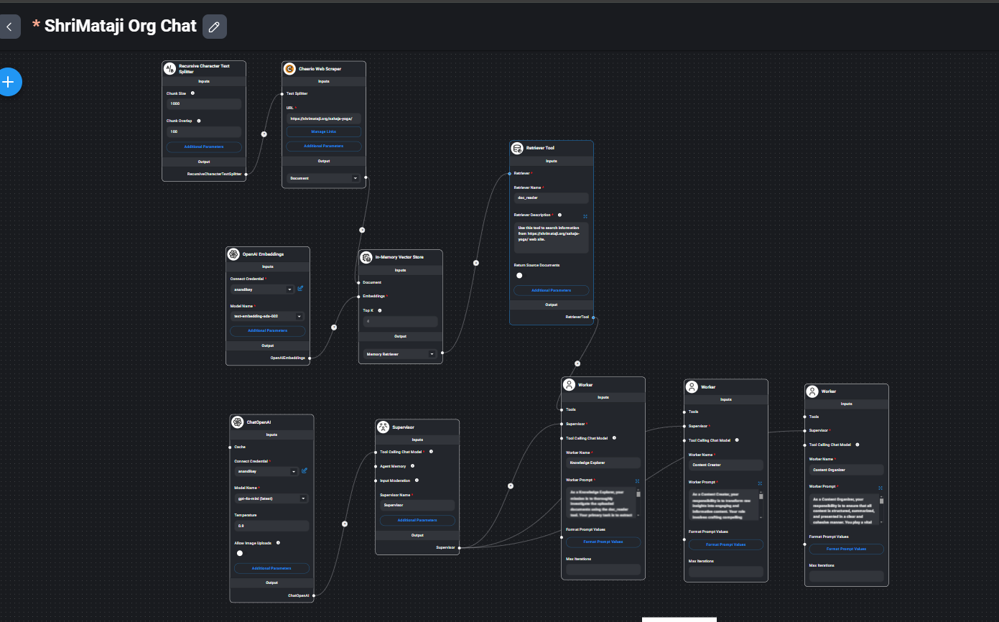

# Flowise AI Chatbots for KNC Product Catalogue & Sahaja Yoga

## Overview
This project leverages **Flowise AI Agents** to create intelligent chatbots for two distinct purposes:
1. **KNC Product Catalogue Chatbot** – A chatbot designed to assist users in exploring and understanding the KNC product catalog efficiently.
2. **Sahaja Yoga Chatbot** – A chatbot that provides information about Sahaja Yoga, utilizing data sourced from [Shrimataji.org](https://www.shrimataji.org).

   

## Features
- **Flowise AI-Powered Agents** for seamless conversation flow.
- **Natural Language Processing (NLP)** to understand user queries.
- **Dynamic Information Retrieval** from structured and unstructured data.
- **Customizable Responses** based on business and spiritual information needs.
- **User-Friendly Interface** for a smooth chat experience.

## Technology Stack
- **Flowise AI** – Low-code AI agent framework for building conversational AI.
- **Node.js** – Backend for API integrations.
- **LangChain** – Used for LLM-powered reasoning.
- **Vector Database** – For efficient semantic search and retrieval-based responses.
- **Web UI** – Embedded chatbot UI for interaction.

## Flowise Json files which represents workflow for  AI master / workers
-KNC Chat Agents.json
-ShriMataji Org Chat Agents.json

## Setup & Installation
### Prerequisites
- Node.js (v16+)
- npm or yarn
- Flowise AI setup ([Installation Guide](https://github.com/FlowiseAI/Flowise))
- Database (optional for vector storage)

## Usage
- **KNC Chatbot:** Helps users find product details, availability, and recommendations.
- **Sahaja Yoga Chatbot:** Provides insights into Sahaja Yoga, meditative practices, and teachings of Shri Mataji.

