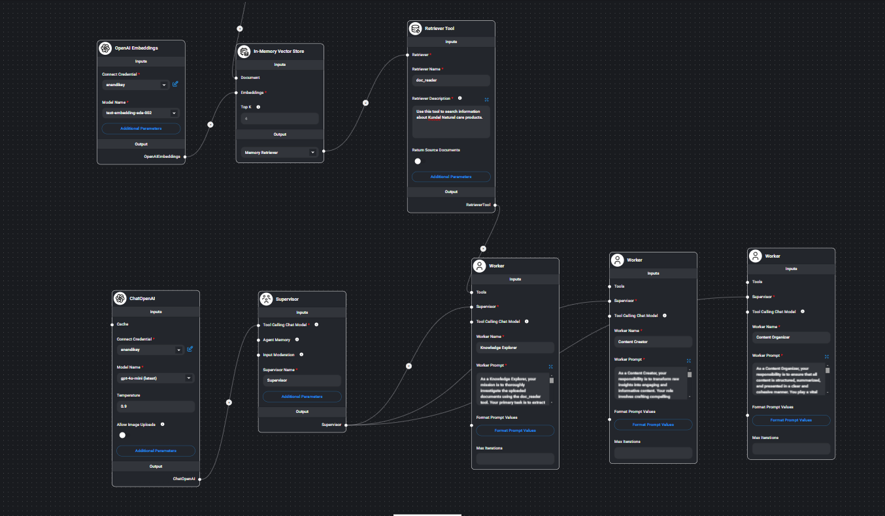

# Flowise AI Chatbots for KNC Product Catalogue & Sahaja Yoga

## Overview
This project leverages **Flowise AI Agents** to create intelligent chatbots for two distinct purposes:

1. **KNC Product Catalogue Chatbot** – A chatbot designed to assist users in exploring and understanding the KNC product catalog efficiently.
   
   
3. **Sahaja Yoga Chatbot** – A chatbot that provides information about Sahaja Yoga, utilizing data sourced from [Shrimataji.org](https://www.shrimataji.org).


   

## Features
- **Flowise AI-Powered Agents** for seamless conversation flow.
- **Natural Language Processing (NLP)** to understand user queries.
- **Dynamic Information Retrieval** from structured and unstructured data.
- **Customizable Responses** based on business and spiritual information needs.
- **User-Friendly Interface** for a smooth chat experience.

## Technology Stack
- **Flowise AI** – Low-code AI agent framework for building conversational AI.
- **Node.js** – Backend for API integrations.
- **LangChain** – Used for LLM-powered reasoning.
- **Vector Database** – For efficient semantic search and retrieval-based responses.
- **Web UI** – Embedded chatbot UI for interaction.

## Flowise Json files which represents workflow for  AI master / workers
-KNC Chat Agents.json
-ShriMataji Org Chat Agents.json


## Usage
- **KNC Chatbot:** Helps users find product details, availability, and recommendations.
- **Sahaja Yoga Chatbot:** Provides insights into Sahaja Yoga, meditative practices, and teachings of Shri Mataji.

## AI Agents with Flowise

## Overview
Flowise is a powerful, open-source, low-code platform for building AI-powered workflows and agents. It allows developers to design, deploy, and integrate AI models with ease. This repository demonstrates how to create and manage AI agents using Flowise.

## Features
- **Low-code AI Development**: Easily design AI agents using a visual interface.
- **Modular Components**: Connect various AI models, APIs, and logic flows.
- **Customizable Workflows**: Modify and extend AI agent behavior for different use cases.
- **Integration Support**: Connect with external APIs, databases, and messaging platforms.

## Prerequisites
- Node.js (version 16 or later)
- npm or yarn
- Docker (optional for containerized deployment)
- Flowise installed (see below for setup instructions)

## Installation
1. Clone this repository:
   ```bash
   git clone https://github.com/your-repo/flowise-ai-agents.git
   cd flowise-ai-agents
   ```
2. Install dependencies:
   ```bash
   npm install
   ```
3. Start Flowise:
   ```bash
   npx flowise start
   ```
   Alternatively, using Docker:
   ```bash
   docker run -p 3000:3000 flowiseai/flowise
   ```
4. Access Flowise UI at `http://localhost:3000`

## Creating an AI Agent
1. Open the Flowise UI.
2. Create a new project.
3. Add components such as:
   - **LLM Models (e.g., OpenAI, Hugging Face, Local Models)**
   - **Data Sources (APIs, Databases, Custom Inputs)**
   - **Processing Nodes (Logic, Conditionals, Function Calls)**
   - **Output Handlers (Chatbots, Webhooks, Notifications)**
4. Configure the agent workflow by linking components.
5. Save and deploy the agent.

## Running and Testing
- Run the agent using Flowise UI or trigger it via API.
- Test responses and refine the workflow.
- Use logs and debugging tools for troubleshooting.

## Deployment
To deploy your Flowise-based AI agent:
- **Docker Deployment**:
  ```bash
  docker build -t flowise-ai-agent .
  docker run -p 3000:3000 flowise-ai-agent
  ```
- **Cloud Hosting**: Deploy on AWS, Azure, or Google Cloud.
- **Integration**: Connect with applications using REST or WebSockets.


